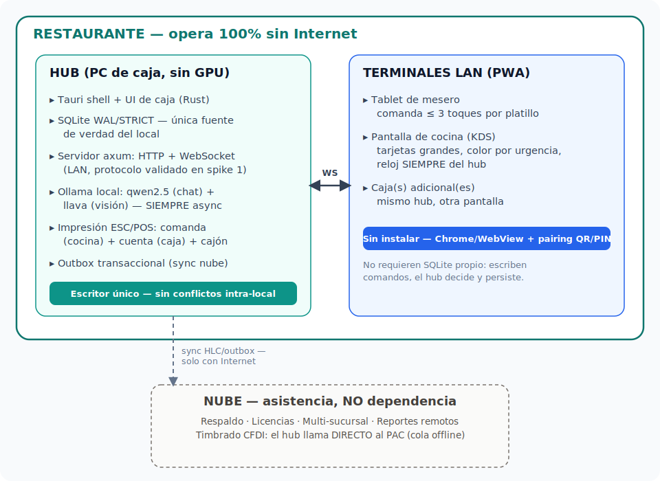
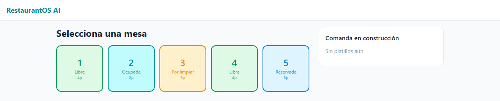
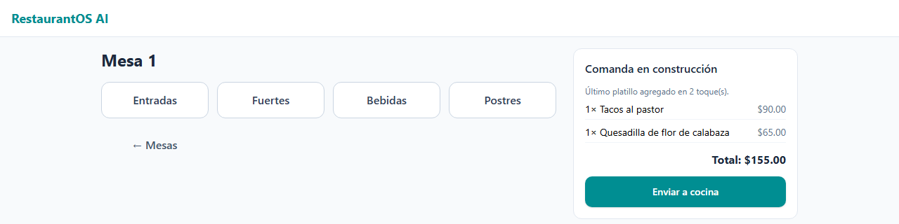
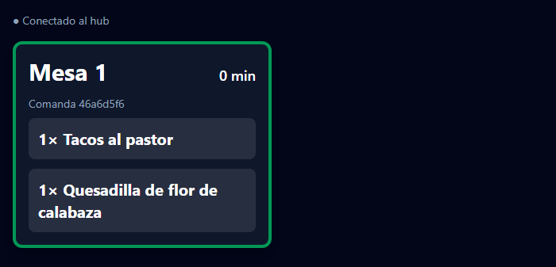
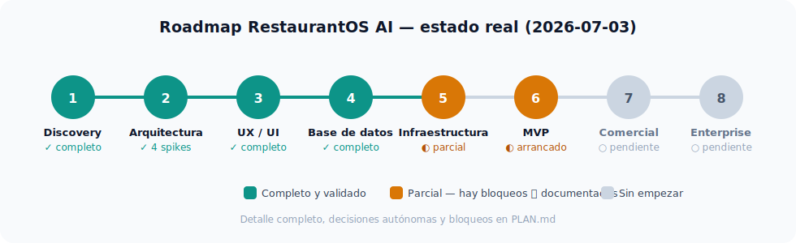

# RestaurantOS AI

**Sistema operativo Local-First / AI-First / Touch-First para restaurantes.**
Opera 100% sin Internet sobre una PC modesta — caja, mesas, comandas y
cocina en red local — con IA 100% local vía Ollama, y la nube solo como
asistencia (respaldo, sync, licencias, CFDI), nunca como dependencia.

> Estado: **en construcción activa**, evolución vertical de
> [`pos-inteligente`](#relación-con-pos-inteligente).



---

## Capturas reales

Prototipo funcional de la Fase 6: el mesero manda la comanda y la cocina la
ve en vivo, de punta a punta contra el hub real (Rust/axum), no un mock.

| Mesero — plano de mesas | Mesero — comanda en construcción |
|---|---|
|  |  |

**Cocina (KDS)** — recibe la comanda enviada por el mesero en menos de un
segundo, vía el protocolo validado en el [spike 1](docs/spikes/spike-1-multiterminal.md):



---

## El problema

Los restaurantes independientes en México operan hoy con papel y lápiz, un
POS de mostrador que no entiende mesas ni comandas, o un SaaS en la nube que
deja de funcionar justo cuando cae el Internet del local — en la hora pico
de un viernes en la noche. RestaurantOS AI resuelve lo único que de verdad
importa: **una comanda que viaja de la mesa a la cocina sin perderse, sin
duplicarse, y sin depender de que el router tenga buen día.**

## Cómo funciona

- **Un hub, una sola fuente de verdad.** La PC de caja principal corre
  [Tauri](https://tauri.app/) (Rust) con SQLite (WAL/STRICT) y un servidor
  HTTP+WebSocket embebido ([axum](https://github.com/tokio-rs/axum)). Es el
  único que escribe — elimina de raíz los conflictos de "dos meseros, misma
  mesa".
- **Terminales sin instalar.** Tablets de mesero, pantalla de cocina (KDS) y
  cajas adicionales son PWAs servidas por el propio hub — cualquier
  navegador en la red local, sin apps que actualizar una por una.
- **Protocolo LAN idempotente.** Cada acción del mesero es un comando con
  UUID propio que se reintenta solo hasta confirmarse — una tablet que
  pierde WiFi a media comanda se reconecta y el hub deduplica, sin perder ni
  repetir nada. [Validado con tests automatizados en Node y en Rust.](docs/spikes/spike-1-multiterminal.md)
- **IA local, nunca en el camino crítico.** [Ollama](https://ollama.com/)
  (`qwen2.5` para el copiloto conversacional del dueño, `llava` para visión/
  OCR) corre en la misma PC. El sistema completo funciona sin IA; la IA
  nunca puede bloquear una venta o una comanda.
- **CFDI 4.0 sin intermediario obligatorio.** El hub timbra directo contra
  el PAC cuando hay Internet, con cola offline si no la hay.

## Roadmap



| Fase | Qué es | Estado |
|---|---|---|
| 1. Discovery | Visión, decisiones congeladas (ADR-1..6) | ✅ |
| 2. Arquitectura | 4 spikes de riesgo + documentación formal | ✅ |
| 3. UX/UI | Design System extendido, prototipo de comanda | ✅ |
| 4. Base de datos | 16 migraciones SQLite, validadas con datos reales | ✅ |
| 5. Infraestructura | Hub Rust/axum, pairing, PWA — falta empaquetado/updater | 🟡 |
| 6. MVP | Mesero↔hub↔KDS en vivo — falta caja, impresión, RBAC, IA | 🟡 |
| 7. Comercial | CFDI real, delivery, reservas, promociones | ⬜ |
| 8. Enterprise | Multi-sucursal, plugins, API pública | ⬜ |

El detalle completo por fase — decisiones autónomas, bloqueos ⛔ y el
próximo paso concreto — vive en **[`PLAN.md`](PLAN.md)**, el documento vivo
del proyecto.

## Stack técnico

| Capa | Tecnología |
|---|---|
| Shell de escritorio (hub) | [Tauri 2](https://tauri.app/) (Rust) |
| Servidor LAN (HTTP + WebSocket) | [axum](https://github.com/tokio-rs/axum) + [tokio](https://tokio.rs/) |
| Base de datos | SQLite (WAL, `STRICT`) → SQLCipher en producción |
| Frontend | React 18 + TypeScript + [Vite](https://vite.dev/) + [Tailwind CSS v4](https://tailwindcss.com/) |
| IA local | [Ollama](https://ollama.com/) — `qwen2.5` (chat/tools), `llava` (visión), `nomic-embed-text` (embeddings) |
| Facturación (México) | CFDI 4.0 vía [SW Sapien](https://sw.com.mx/) o [Facturama](https://facturama.mx/) |

## Estructura del repo

```
restaurantos-ai/
├── PLAN.md                  # documento vivo: estado, decisiones, bitácora
├── docs/                    # arquitectura, dominio, UX, riesgos, spikes
│   ├── db/migrations/       # 16 migraciones SQLite (fuente de verdad del esquema)
│   ├── spikes/              # mini-informes de los 5 spikes de riesgo
│   └── ux/                  # flujos, casos de uso, Design System
├── spikes/                  # prototipos ejecutables de los spikes (Node)
└── app/                     # aplicación
    ├── src/
    │   ├── domain/          # lógica de negocio pura (sin I/O)
    │   ├── app/              # casos de uso, puertos
    │   ├── infra/            # SQLite, cliente del hub, memoria
    │   └── ui/                # pantallas (Mesero, Cocina) + Design System
    └── src-tauri/            # shell Rust: hub axum, comandos Tauri
```

## Cómo correrlo

**Frontend (Mesero/KDS en el navegador, sin Tauri):**
```bash
cd app
npm install
npm run dev        # http://localhost:5190 (mesero) · ?role=kds (cocina)
```

**Hub completo (Tauri + servidor LAN en Rust):**
```bash
cd app/src-tauri
cargo run           # sirve el hub en :5190 (HTTP, WS y la PWA empaquetada)
```

**Verificación:**
```bash
cd app && npm run typecheck && npm test && npm run build   # TS
cd app/src-tauri && cargo test                              # Rust
```

## Relación con `pos-inteligente`

RestaurantOS AI es la **evolución vertical** de
[`pos-inteligente`](https://github.com/Kiosa7/pos-inteligente) — un POS de
mostrador para PYMES ya validado (arquitectura por capas, dominio con dinero
en centavos y UUID v7, protocolo de sync HLC/outbox, IA local). Este repo
reutiliza esa base y agrega lo genuinamente nuevo de un restaurante:
multi-terminal LAN, mesas/comandas con ciclo de vida largo, recetas y
CFDI 4.0.

## Licencia

Código disponible públicamente, sin una licencia de código abierto formal
todavía — todos los derechos reservados por ahora.
